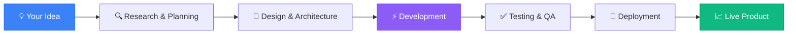

<div align="center">
  
# 👋 Hi, I'm Rayen Lazizi

[](https://git.io/typing-svg)

### 🚀 Crafting Modern, Scalable Web Applications That Drive Business Growth

[](https://rayenlazizi.tech)
[](https://www.linkedin.com/in/rayen-azizi-5b97843a6/)
[](mailto:rayenazizi112211@gmail.com)

</div>

---

## 💼 About Me

```typescript
const rayen = {
    role: "Full-Stack Web Developer",
    location: "🌍 Available Worldwide (Remote)",
    focus: ["Web Development", "UI/UX Design", "Performance Optimization"],
    currentlyWorking: "Building scalable solutions for businesses",
    openTo: ["Freelance Projects", "Collaborations", "Full-time Opportunities"],
    motto: "Don't just write code — deliver solutions ✨"
};
```

I specialize in transforming ideas into **production-ready websites** that are fast, modern, and user-friendly. My approach combines **clean code**, **best practices**, and a deep understanding of what makes businesses succeed online.

---

## �️ Tech Stack & Tools

<div align="center">

### Frontend Development


### Backend Development


### Database & Cloud


### Tools & Deployment


</div>

---

## � What I Do Best

<table>
<tr>
<td width="50%">

### 🎨 Frontend Excellence
- Build **scalable & responsive** interfaces
- Implement **modern UI/UX** designs
- Optimize for **performance & accessibility**
- Create **pixel-perfect** implementations

</td>
<td width="50%">

### ⚙️ Backend Mastery
- Design **robust APIs** & server architecture
- Implement **secure authentication** systems
- Optimize **database queries** & performance
- Deploy to **production environments**

</td>
</tr>
</table>

---

## 🌟 Featured Project

<div align="center">

### � [Unyamee.com](https://unyamee.shop)

**A Modern, Full-Stack E-Commerce & Service Platform**

[](https://unyamee.shop)

</div>

**🎯 Role:** Full-Stack Developer — Complete ownership of frontend, backend, deployment, and SEO optimization

**🔧 Tech Stack:**
```
Frontend:  Next.js • React • Tailwind CSS
Backend:   Node.js • Express • Python
Database:  MongoDB
Deployment: Vercel
```

**✨ Key Achievements:**
- ✅ **Responsive Design** — Seamless experience across all devices
- ✅ **Lightning Fast** — Optimized performance with Next.js SSR/SSG
- ✅ **SEO Optimized** — Structured data & meta optimization for search visibility
- ✅ **Secure Backend** — Robust authentication & data protection
- ✅ **Payment Integration** — Stripe integration for seamless transactions
- ✅ **Modern UI/UX** — Clean, intuitive interface that converts visitors

**📈 Impact:**
> Built a complete production-ready platform from concept to deployment, handling everything from database design to frontend polish.

---

## 📊 GitHub Stats

<div align="center">
  


</div>

---

## 💡 Why Work With Me?

<div align="center">

| 🎯 **Solution-Focused** | 🚀 **Fast Delivery** | 💬 **Clear Communication** | 🔧 **Full-Stack Expertise** |
|:---:|:---:|:---:|:---:|
| I don't just code — I solve problems | Efficient workflows & proven processes | Regular updates & transparent collaboration | Handle your entire project end-to-end |

</div>

### 🌟 My Approach


```mermaid
graph LR
    A[💡 Your Idea] --> B[🔍 Research & Planning]
    B --> C[🎨 Design & Architecture]
    C --> D[⚡ Development]
    D --> E[✅ Testing & QA]
    E --> F[🚀 Deployment]
    F --> G[📈 Live Product]
    
    style A fill:#3B82F6,stroke:#2563EB,color:#fff
    style G fill:#10B981,stroke:#059669,color:#fff
    style D fill:#8B5CF6,stroke:#7C3AED,color:#fff
```

---

## 📫 Let's Connect!

<div align="center">

I'm actively seeking **freelance projects**, **collaborations**, and **full-time opportunities**.

Let's build something amazing together! 🚀

[](https://rayenlazizi.tech)
[](https://www.linkedin.com/in/rayen-azizi-5b97843a6/)
[](mailto:rayenazizi112211@gmail.com)

---

### 💭 *"From concept to live product — I'll turn your vision into reality"*


</div>
